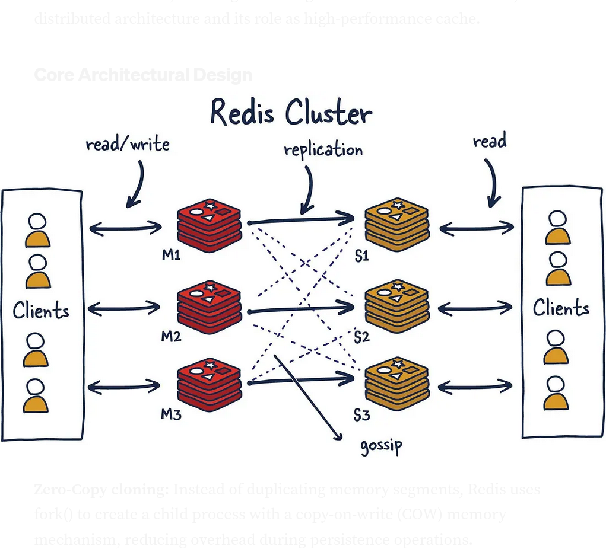

### What is Redis

- Redis(Remote dictionary server) is a database server that depends on in-memory storage to manage and store data in RAM

#### Architectural Design

- It's use in 
 1. distributed caching
 2. session management
 3. real-time analytics

